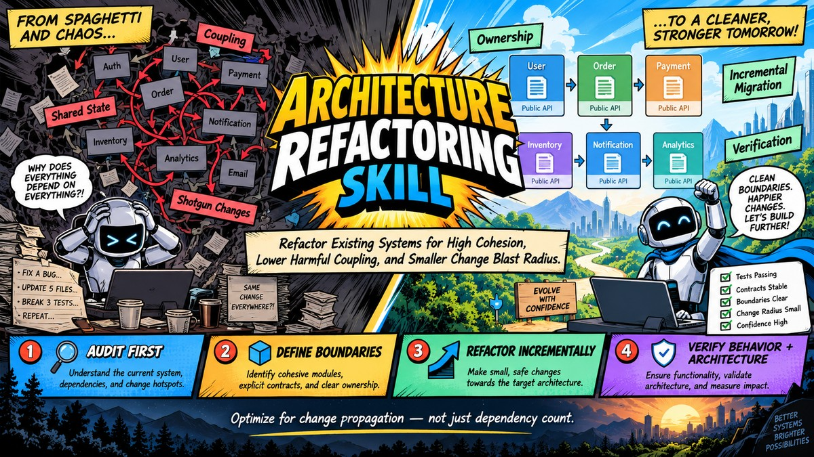

<p align="center">
  
</p>

# 架构重构 Skill

[English](README.md) | **简体中文**

一个与具体工具无关的 Agent Skill，用于把**已有**软件系统重构为更高内聚、更低有害耦合、更明确的归属、更小的变更影响半径。

> 优化的是变更传播，而不只是依赖数量。

## 为什么需要这个 Skill

大多数"架构"提示词会让 Agent 套用模式：Clean Architecture、SOLID、依赖注入、Repository、事件总线。这些是技术手段，不是目标。把它们硬套到可运行的系统上，运行时耦合可能分毫未动，只是多了目录、接口和跳转层。

这个 Skill 把架构当作**承载变更的结构**：

- 一起变化的代码，应该放在一起；
- 因不同原因变化的代码，应该分开；
- 跨边界的知识应当窄、显式、稳定。

它不是 Clean Architecture 生成器，不强制抽象。当证据表明一个稳定的模块应该保持原样时，它会明确建议"不动"。

## 工作流

头图把完整的 [SKILL.md](SKILL.md) 工作流浓缩为四步：

1. **先审计** —— 提案之前，先理解现状：依赖、数据流、变更热点。
2. **定义边界** —— 识别内聚模块、显式契约与明确归属；每个边界必须回答：职责、不变量、数据归属、公开契约、允许/禁止的依赖方向。
3. **增量重构** —— 引入接缝、迁移一个调用方、验证、再迁移其余；绝不大爆炸重写。
4. **行为与架构分开验证** —— 测试证明行为未变；依赖方向、归属关系与影响半径证明架构真的改善。

Skill 会在相关任务出现时自动加载，并坚持"证据优先于模式合规"，内置明确的停止条件和常见重构反模式清单。

## 目录结构

```text
architecture-refactoring/
├── SKILL.md                      # 工作流、范围预算、Red flags、Gotchas
├── references/
│   ├── PRINCIPLES.md             # 边界决策需要论证时读
│   ├── AUDIT_GUIDE.md            # 审计子系统或全仓之前读
│   ├── REFACTORING_PLAYBOOK.md   # 选择"最小操作"时读
│   ├── EXAMPLES.md               # 端到端实例（含"建议不动"的案例）
│   ├── VERIFICATION.md           # 执行第一个迁移步骤之前读
│   ├── TOOLING.md                # 各生态的依赖/循环/规则固化工具
│   └── ANTI_PATTERNS.md          # 大规模改动之前读
├── assets/templates/             # 审计、计划、报告模板
└── evals/                        # 测试夹具与评测工具（场景 + 触发）
```

## 安装

Skill 本质是一个带 `SKILL.md` 的文件夹；任何支持
[Agent Skills](https://agentskills.io) 格式的 Agent 都可以加载。

**Claude Code**（用户级）：

```bash
git clone https://github.com/4iKZ/architecture-refactoring-skill \
  ~/.claude/skills/architecture-refactoring
```

Windows PowerShell 请克隆到 `$HOME\.claude\skills\architecture-refactoring`。
项目级安装则放到 `.claude/skills/architecture-refactoring/`。

**OpenCode**：

```bash
git clone https://github.com/4iKZ/architecture-refactoring-skill \
  ~/.config/opencode/skills/architecture-refactoring
```

**Codex 及其他跨客户端 Agent**：

```bash
git clone https://github.com/4iKZ/architecture-refactoring-skill \
  ~/.agents/skills/architecture-refactoring
```

**手动安装**：把本目录复制到你的客户端的 skills 目录即可。请保持文件夹名为
`architecture-refactoring`，与 frontmatter 中的 `name` 一致。

## 使用方式

先审计，不改代码：

```text
使用 architecture-refactoring skill 检查本仓库。
先不要改代码。审计 <子系统> 附近的架构，找出价值最高的内聚/耦合问题，
产出架构审计与重构计划。每一条建议都必须有具体的代码/依赖/数据流证据。
```

确认计划后增量执行：

```text
使用 architecture-refactoring skill 按已批准的计划增量执行。
保持行为不变，每个迁移步骤后验证；如果新证据推翻目标边界就停下来。
```

范围较小的任务：

```text
使用 architecture-refactoring skill 重构 <模块>。
分析范围限定在该模块及其直接依赖邻域，除非发现问题是系统性的。
```

不需要说出"架构"二字，它也会被症状触发——"为什么所有东西都互相依赖"、
"改一个 bug 弄坏三个测试"、"该从哪里开始清理"。

**不适用场景**：绿地新项目设计、机械改名、代码格式化、依赖升级、纯风格清理。
这些应当作为独立的变更处理。

## 评测

`evals/` 目录包含四个带断言评分标准的场景、两个合成 fixture（依赖环、共享状态
归属问题）以及一套 20 条、固定 train/validation 划分的触发评测集。

```bash
# 触发评测（需要 claude CLI；先把 skill 安装进工作区）
python evals/run_trigger_eval.py --workspace <workspace> --output results.json

# 运行某个场景
python evals/run_scenario_eval.py --scenario 1 --workspace <ws> \
  --with-skill . --out <run-dir>

# 规范合规自检
python evals/validate_skill.py
```

技能的自动发现依赖宿主 Agent。如果你的 Agent 不会自动调用 skill，请显式点名：
"use the architecture-refactoring skill"。详见 [evals/README.md](evals/README.md)
与 [evals/RESULTS.md](evals/RESULTS.md)。

## License

[Apache-2.0](LICENSE)
